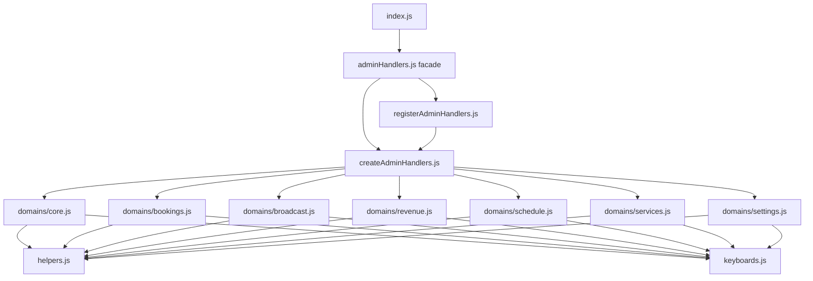

# Рефакторинг adminHandlers.js на модули

## Контекст

Сейчас вся админ-панель MAX Bot живёт в одном файле [`src/maxBot/admin/adminHandlers.js`](src/maxBot/admin/adminHandlers.js) (~2185 строк). Проект стабилен: миграция из Telegram завершена, функционал соответствует [`MASTER.md`](MASTER.md) и [`MANAGER.md`](MANAGER.md).

Точка входа — [`index.js`](index.js), импортирует только `registerAdminHandlers`:

```9:9:index.js
const { registerAdminHandlers } = require("./src/maxBot/admin/adminHandlers");
```

Публичные экспорты (нельзя ломать без причины):

```2178:2184:src/maxBot/admin/adminHandlers.js
module.exports = {
  registerAdminHandlers,
  ADMIN_MODE,
  buildMainMenuKeyboard,
  buildSettingsMenuKeyboard,
  buildScheduleMenuKeyboard,
};
```

Существующий паттерн проекта: `create*Handlers(deps)` + `register*Handlers(bot, deps)` — как в [`userHandlers.js`](src/maxBot/userHandlers.js) и [`bookingScene.js`](src/maxBot/scenes/bookingScene.js).

## Целевая структура

```
src/maxBot/admin/
├── adminHandlers.js          # тонкий фасад (стабильный import path)
├── constants.js              # ADMIN_MODE, MAX_BROADCAST_RECIPIENTS
├── helpers.js                # getUserId, getMessage*, clearAdminScenario, toIsoDate, isAdminMode
├── keyboards.js              # все build*Keyboard()
├── createAdminHandlers.js    # композиция доменов
├── registerAdminHandlers.js  # регистрация bot.* (извлечь из текущего файла)
└── domains/
    ├── core.js               # auth, меню, роутер callback, оркестратор text/image
    ├── bookings.js           # записи, статистика, отмена по коду
    ├── broadcast.js          # рассылка + статус рассылки
    ├── revenue.js            # финансовая статистика
    ├── schedule.js           # расписание (scheduleAction)
    ├── services.js           # CRUD услуг (servicesAction)
    └── settings.js           # бан, контакты, портфолио, локация, напоминания
```

Границы модулей совпадают с разделами документации:

| Модуль      | MASTER.md / MANAGER.md                                         | Session-флаг     | Callback-префиксы                         |
| ----------- | -------------------------------------------------------------- | ---------------- | ----------------------------------------- |
| `bookings`  | Просмотр записей, Статистика, Отмена по коду                   | `adminAction`    | `bookings`, `stats`, `cancel_code`        |
| `broadcast` | Массовая рассылка, Статус рассылки                             | `adminAction`    | `broadcast*`, `broadcast_status`          |
| `revenue`   | Финансовая статистика                                          | —                | `revenue:*`                               |
| `schedule`  | Настройки расписания                                           | `scheduleAction` | `schedule_*`                              |
| `services`  | Управление услугами                                            | `servicesAction` | `services_*`, `service_edit/field/delete` |
| `settings`  | Бан, контакты, портфолио, локация, чаевые, напоминание 28 дней | `adminAction`    | `ban`, `unban`, `reminder_28`, …          |
| `core`      | Вход в `/admin`, навигация, `/admin_cancel`                    | `mode`           | `main_menu`, `settings`, `user_mode`      |

## Архитектура композиции



### Общий контекст для доменов

Чтобы не плодить длинные списки аргументов, `createAdminHandlers` собирает объект `adminCtx`:

```js
const adminCtx = {
  adapter,
  sheetsService,
  bookingService,
  bot,
  config,
  showUserMainMenu,
  menus: { showMainMenu, showSettingsMenu, showScheduleMenu, showServicesMenu },
  clearAdminScenario,
};
```

Каждый `createXxxHandlers(adminCtx)` возвращает именованные функции. `core.js` собирает `handleAdminCallback` из map действий:

```js
const adminActions = {
  bookings: bookings.showAllBookings,
  stats: bookings.showStats,
  // ...
};
```

Это заменяет монолитный `switch` (~30 case) без изменения поведения.

### Оркестрация text/image (остаётся в core)

Текущая цепочка сохраняется:

```2029:2042:src/maxBot/admin/adminHandlers.js
  const handleAdminText = async (ctx) => {
    const text = getMessageText(ctx);
    if (!text) return false;

    if (await processScheduleActionText(ctx, text)) {
      return true;
    }
    if (await processServicesActionText(ctx, text)) {
      return true;
    }
    if (await processAdminActionText(ctx, text)) {
      return true;
    }
    return false;
  };
```

- `processScheduleActionText` → `schedule.js`
- `processServicesActionText` → `services.js`
- `processAdminActionText` → делегирует в `bookings`, `broadcast`, `settings` по `adminAction.type`

`handleAdminImage` — в `core.js`, делегирует `portfolio_upload` → settings, `broadcast` → broadcast.

## Пошаговый план выполнения

### Этап 1 — Извлечь stateless-слой (низкий риск)

Вынести без изменения логики:

- [`constants.js`](src/maxBot/admin/constants.js) — строки 22–23
- [`helpers.js`](src/maxBot/admin/helpers.js) — строки 25–70, 50–60
- [`keyboards.js`](src/maxBot/admin/keyboards.js) — строки 72–193

Проверка: `node --check` на всех новых файлах.

### Этап 2 — Извлечь доменные модули (по одному)

Порядок от наименее связанных к наиболее:

1. **`revenue.js`** (~110 строк, изолирован: `handleRevenueCallback`, `showRevenueMenu`)
2. **`bookings.js`** (~150 строк: `showAllBookings`, `showStats`, `startCancelByCode`, cancel-by-code text)
3. **`broadcast.js`** (~220 строк: status, preview, confirm/cancel, broadcast text/photo)
4. **`services.js`** (~350 строк: picker-ы, callbacks `service_*`, `processServicesActionText`)
5. **`settings.js`** (~400 строк: ban/unban, contacts, portfolio, location, reminder, tips)
6. **`schedule.js`** (~420 строк: все `startSchedule*`, `processScheduleActionText`)
7. **`core.js`** (~250 строк: `checkAdmin`, меню, `handleAdminCallback` map, `handleAdminCancel`, text/image orchestration)

На каждом шаге — перенос «как есть», без рефакторинга логики.

### Этап 3 — Композиция и регистрация

- [`createAdminHandlers.js`](src/maxBot/admin/createAdminHandlers.js) — вызывает все `create*Handlers`, возвращает тот же объект методов, что сейчас (строки 2045–2058)
- [`registerAdminHandlers.js`](src/maxBot/admin/registerAdminHandlers.js) — перенос строк 2067–2175 без изменений
- [`adminHandlers.js`](src/maxBot/admin/adminHandlers.js) — ~15 строк re-export:

```js
module.exports = {
  registerAdminHandlers: require("./registerAdminHandlers"),
  ADMIN_MODE: require("./constants").ADMIN_MODE,
  ...require("./keyboards"), // только публичные builders
};
```

**Import в `index.js` не меняется.**

## Критические инварианты (не нарушать)

1. **Middleware `message_created`** — обязательно вызывать `next()`, если не admin / booking active / нет сценария (строки 2137–2173). Иначе сломается booking flow.
2. **Session-флаги** — `mode`, `adminAction`, `servicesAction`, `scheduleAction`, `fromSettings` — имена и семантика без изменений.
3. **Callback payload-паттерны** — `admin:`, `revenue:`, `service_edit:`, `service_field:`, `service_delete:`, `service_cancel` — те же regex в регистрации.
4. **Проверка admin** — `adapter.isAdmin(ctx)` + fallback на `config.managerChatId` (строки 199–208).
5. **Зависимость от booking** — `isBookingActive(ctx)` из [`bookingScene.js`](src/maxBot/scenes/bookingScene.js) остаётся только в `registerAdminHandlers.js`.

## Проверка после рефакторинга

Автотестов в проекте нет ([`package.json`](package.json) — только `start`/`dev`). Ручной smoke-test по чеклисту из MASTER.md:

- `/admin` → главное меню, все кнопки отвечают
- Просмотр записей / Статистика
- Отмена по коду (валидный и невалидный код)
- Массовая рассылка: текст, фото, preview, confirm/cancel
- Статус рассылки
- Финансовая статистика: все периоды + «По услугам»
- Настройки: бан/разбан, услуги (add/edit/delete), напоминание 28 дней, чаевые, контакты
- Портфолио: загрузка фото, удаление по номеру
- Локация
- Расписание: view/edit/delete/all/weekday templates
- `/admin_cancel` в середине сценария
- «Вернуться в пользовательский режим» + проверка, что booking flow клиента не затронут

Техническая проверка: `node --check` на всех файлах admin/, запуск `npm start`, отсутствие ошибок при старте.

## Что сознательно НЕ делаем

- Не меняем бизнес-логику, тексты, лимиты (`MAX_BROADCAST_RECIPIENTS = 250`)
- Не трогаем [`src/services/*`](src/services/) — доменная логика уже вынесена
- Не разбиваем [`bookingScene.js`](src/maxBot/scenes/bookingScene.js) — вне scope
- Не добавляем тестовый фреймворк — только если попросите отдельно
- Не обновляем MASTER.md/MANAGER.md — документация описывает UX, а не структуру кода

## Ожидаемый результат

| Файл                                                           | ~строк |
| -------------------------------------------------------------- | ------ |
| `helpers.js` + `constants.js` + `keyboards.js`                 | ~170   |
| `domains/core.js`                                              | ~250   |
| `domains/bookings.js`                                          | ~150   |
| `domains/broadcast.js`                                         | ~220   |
| `domains/revenue.js`                                           | ~110   |
| `domains/schedule.js`                                          | ~420   |
| `domains/services.js`                                          | ~350   |
| `domains/settings.js`                                          | ~400   |
| `createAdminHandlers.js` + `registerAdminHandlers.js` + facade | ~150   |

Вместо одного файла на 2185 строк — 12 файлов по 100–420 строк, каждый с одной зоной ответственности. Добавление новой админ-функции = правка одного доменного модуля + одна строка в action map.
