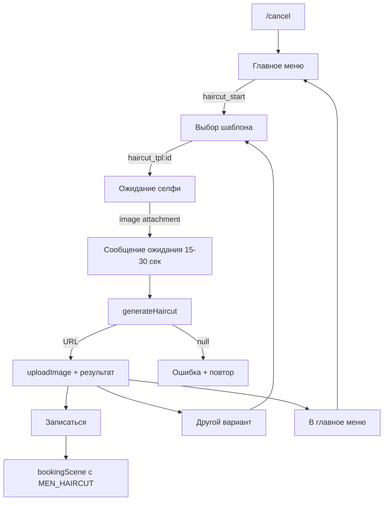

# План: сценарий «AI-подбор стрижки»

## Архитектура потока



## 1. Хранение шаблонов стрижек

**Решение: `haircutTemplates.json` + сервис [`src/services/haircutTemplatesService.js`](src/services/haircutTemplatesService.js)** (паттерн как [`src/services/services.js`](src/services/services.js) + [`services.json`](services.json)).

| Вариант                    | Плюсы                                                                                       | Минусы                                                                                  |
| -------------------------- | ------------------------------------------------------------------------------------------- | --------------------------------------------------------------------------------------- |
| **JSON + сервис (выбран)** | CRUD через админ-меню позже без деплоя Sheets; быстрое чтение; уже есть прецедент для услуг | Нужен redeploy только при ручном редактировании файла                                   |
| Google Sheets              | Редактирование в таблице                                                                    | Сложнее схема (id/name/url); лишний latency; портфолио хранит только URL без метаданных |
| Константа в коде           | Просто                                                                                      | Нет пути к админ-управлению                                                             |

**Схема записи шаблона:**

```json
{
  "id": "fade_low",
  "name": "Низкий fade",
  "photoUrl": "https://example.com/templates/fade_low.jpg",
  "serviceKey": "MEN_HAIRCUT"
}
```

- Файл: [`haircutTemplates.json`](haircutTemplates.json) в корне проекта (10 seed-записей с placeholder HTTPS-URL — заменить на реальные фото).
- Сервис экспортирует: `getAllTemplates()`, `getTemplateById(id)`, `validateTemplateId(id)`.
- **Будущий админ**: домен `admin/domains/haircutTemplates.js` сможет переиспользовать CRUD-паттерн из [`src/maxBot/admin/domains/services.js`](src/maxBot/admin/domains/services.js) без изменения сценария.

## 2. Получение URL фото клиента из MAX API

Ranvik принимает только **HTTPS URL** ([`generateHaircut`](src/services/aiHaircutService.js)). Вложение пользователя — через `ctx.message?.body?.attachments`, тип `image`.

**Решение: утилита `resolveClientPhotoUrl(ctx, adapter, attachment)`** (новый файл [`src/utils/resolveClientPhotoUrl.js`](src/utils/resolveClientPhotoUrl.js) или секция в `haircutScene.js`):

1. Найти attachment: `attachments.find(a => a?.type === 'image')` — переиспользовать логику из [`src/maxBot/admin/helpers.js`](src/maxBot/admin/helpers.js) (`getMessageImageAttachment`).
2. Валидация: [`validateImageAttachment`](src/utils/security.js) (JPEG/PNG/WebP, размер).
3. **Приоритет URL:** если `attachment.payload.url` проходит [`validateSafeUrl`](src/utils/security.js) → вернуть напрямую в Ranvik.
4. **Fallback по token:** если есть только `payload.token` → запрос к MAX Platform API (аналог [`GET /videos/{videoToken}`](https://dev.max.ru/docs-api/methods/GET/videos/-videoToken-)):
   ```js
   GET https://platform-api.max.ru/images/{token}
   Authorization: {MAX_BOT_TOKEN}
   ```
   Из ответа извлечь публичный `url` (поле `urls` / `url` — уточнить по фактическому ответу API при первом тесте).
5. Если URL не получен → вернуть `null`, бот просит прислать фото заново (не падать).

**Почему не token напрямую в Ranvik:** внешний API не знает токены MAX; нужен публичный HTTPS.

**Отправка результата клиенту:** как в портфолио ([`userHandlers.js:76-77`](src/maxBot/userHandlers.js)):

```js
const image = await ctx.api.uploadImage({ url: resultUrl });
await adapter.reply(ctx, caption, { attachments: [image.toJson(), keyboard] });
```

Параметр `text` — непустая строка (пробел `" "` допустим для фото-only, как в портфолио).

## 3. Новый сценарий [`src/maxBot/scenes/haircutScene.js`](src/maxBot/scenes/haircutScene.js)

### Состояние сессии

```js
ctx.session.haircutAction = {
  step: "choosing_template" | "awaiting_selfie" | "showing_result",
  selectedTemplate: { id, name, photoUrl, serviceKey },
  lastResultUrl: string | null, // опционально для логов
};
```

Отдельно от booking (`ctx.session.flow` / `ctx.session.step`) — без конфликтов.

### Шаги и callback-payloads

| Шаг | Действие                   | Payload / триггер                               |
| --- | -------------------------- | ----------------------------------------------- |
| 1   | Старт, 10 inline-кнопок    | `haircut_start`                                 |
| 2   | Выбор шаблона              | `haircut_tpl:{id}`                              |
| 3   | Инструкция + ожидание фото | `step = awaiting_selfie`                        |
| 4   | Генерация                  | `message_created` + image                       |
| 5   | Результат                  | `haircut_book`, `haircut_retry`, `haircut_menu` |

**Клавиатура шаблонов:** 2 кнопки в ряд × 5 рядов + «Отмена»; [`enforceKeyboardLimits`](src/utils/maxKeyboard.js).

**Критично для webhook timeout:** сразу после валидации фото:

```js
await adapter.reply(
  ctx,
  "⏳ ИИ обрабатывает ваше фото... Это займёт 15-30 секунд.",
);
```

Затем `await generateHaircut(...)` в `try/catch`.

**Логирование:**

- `[haircutScene] start user_id=...`
- `[haircutScene] template selected id=... name=...`
- `[haircutScene] generation result ok|failed user_id=...`

### Экспорт

```js
registerHaircutScene(bot, adapter, sheetsService, bookingHandlers);
cancelHaircutIfActive(ctx, adapter, showMainMenu); // для цепочки /cancel
startHaircutFlow(ctx, adapter); // для bot.hears из userHandlers
isHaircutActive(ctx);
```

### Edge cases (из ТЗ)

- Текст вместо фото на `awaiting_selfie` → «Пришлите, пожалуйста, фото (не текст)».
- Callback шаблона без сессии → «Сессия истекла» + кнопка «Начать заново» (`haircut_start`).
- `generateHaircut` → `null` / timeout / exception → понятное сообщение + «Попробовать снова».
- Ошибка `uploadImage` результата → fallback текст без фото.

### Очистка при старте/выходе

- `clearHaircutSession(ctx)` — `delete ctx.session.haircutAction`
- При старте haircut — `clearBookingSession` (импорт/дублирование 3 строк из bookingScene, не копировать бизнес-логику)
- При переходе к booking — `clearHaircutSession`

## 4. Интеграция с записью (без дублирования bookingScene)

**Минимальное расширение [`bookingScene.js`](src/maxBot/scenes/bookingScene.js):**

Добавить в `createBookingHandlers` и return-object:

```js
async function startBookingWithService(ctx, serviceKey) {
  // checkBanned — как в startBooking
  ctx.session.flow = BOOKING_FLOW;
  ctx.session.data = { serviceKey };
  await showDateStep(ctx); // пропуск выбора услуги
}
```

В `haircutScene` при `haircut_book`:

1. `clearHaircutSession(ctx)`
2. `bookingHandlers.startBookingWithService(ctx, template.serviceKey || 'MEN_HAIRCUT')`

## 5. `/cancel` — цепочка с booking

Сейчас `/cancel` только в [`bookingScene.js:892-901`](src/maxBot/scenes/bookingScene.js).

**Решение:** экспорт `cancelHaircutIfActive` из haircutScene; в handler `/cancel` bookingScene **сначала** вызывает его:

```js
if (await cancelHaircutIfActive(ctx, adapter, h.showMainMenu)) return;
const cancelled = await h.cancelBooking(ctx);
```

Так один `/cancel` покрывает оба сценария без второго конфликтующего handler.

## 6. Главное меню — [`userHandlers.js`](src/maxBot/userHandlers.js) + [`maxKeyboard.js`](src/utils/maxKeyboard.js)

- В [`buildUserMenuKeyboard`](src/utils/maxKeyboard.js) добавить первый ряд:
  ```js
  [Keyboard.button.callback("✨ Подобрать стрижку с ИИ", "haircut_start")];
  ```
- В [`registerUserHandlers`](src/maxBot/userHandlers.js) добавить `bot.hears('✨ Подобрать стрижку с ИИ', ...)` → вызов экспортированного `startHaircutFlow` (на случай, если клиент нажмёт reply-кнопку с тем же текстом).
- `bot.action('haircut_start', ...)` регистрируется в `registerHaircutScene`; в начале — `await adapter.answerCallback(ctx)`.

## 7. Регистрация в [`index.js`](index.js)

```js
const { registerHaircutScene } = require('./src/maxBot/scenes/haircutScene');

const bookingHandlers = registerBookingHandlers(bot, adapter, sheetsService, bookingService);
registerHaircutScene(bot, adapter, sheetsService, bookingHandlers);
registerAdminHandlers(...);
```

**Порядок:** haircut **после** booking (нужен return `bookingHandlers`).

### `message_created` middleware chain

Booking уже делает `if (!isBookingActive) return next()` ([`bookingScene.js:986-988`](src/maxBot/scenes/bookingScene.js)).

Haircut регистрирует аналогичный handler:

```js
bot.on("message_created", async (ctx, next) => {
  if (!isHaircutActive(ctx)) return next();
  if (ctx.session.haircutAction.step === "awaiting_selfie") {
    await handleSelfieMessage(ctx);
    return;
  }
  await adapter.reply(ctx, "Используйте кнопки под сообщением.");
});
```

## 8. Файлы изменений (итог)

| Файл                                      | Действие                                                                     |
| ----------------------------------------- | ---------------------------------------------------------------------------- |
| `haircutTemplates.json`                   | **Создать** — 10 шаблонов                                                    |
| `src/services/haircutTemplatesService.js` | **Создать**                                                                  |
| `src/utils/resolveClientPhotoUrl.js`      | **Создать**                                                                  |
| `src/maxBot/scenes/haircutScene.js`       | **Создать** — основная логика + JSDoc                                        |
| `src/utils/maxKeyboard.js`                | **Изменить** — кнопка в меню                                                 |
| `src/maxBot/userHandlers.js`              | **Изменить** — `bot.hears` для старта                                        |
| `src/maxBot/scenes/bookingScene.js`       | **Изменить** — `startBookingWithService`, цепочка `/cancel`, return handlers |
| `index.js`                                | **Изменить** — регистрация сценария                                          |

**Не трогаем:** [`src/services/aiHaircutService.js`](src/services/aiHaircutService.js), googleSheets, booking algorithms.

## 9. Проверка

```bash
node -c src/maxBot/scenes/haircutScene.js
node -c src/services/haircutTemplatesService.js
node -c src/utils/resolveClientPhotoUrl.js
node -c index.js
```

Ручной тест-план:

1. `/start` → кнопка «✨ Подобрать стрижку с ИИ»
2. Выбор шаблона → инструкция
3. Текст вместо фото → просьба прислать фото
4. Фото → сообщение ожидания → результат или ошибка
5. «Записаться» → выбор даты (без выбора услуги)
6. «Попробовать другой» → список шаблонов
7. `/cancel` на любом шаге → главное меню

## 10. Зависимости окружения

- `RANVIK_API_KEY` в [`.env`](.env) — уже используется сервисом
- `MAX_BOT_TOKEN` — для fallback-резолва image token → URL
