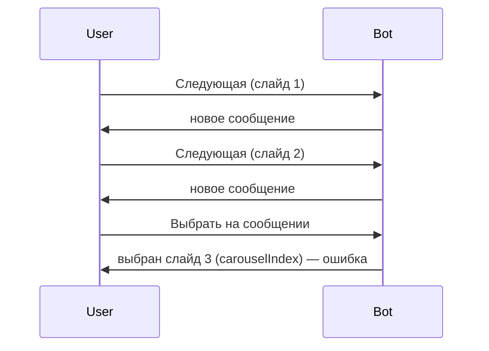

# Исправление карусели референсов

## Проблема

Сейчас в [`haircutScene.js`](src/maxBot/scenes/haircutScene.js):

1. **Листание** (`handleCarouselNav`) вызывает `showTemplateCarousel` → каждый раз `adapter.reply()` → новое сообщение в чате.
2. **Выбор** (`handleCarouselSelect`) берёт шаблон из `action.carouselIndex` в сессии — это индекс **последнего** показанного слайда, а не того, что на экране у старого сообщения.



## Решение (два слоя)

### 1. Листание — редактировать то же сообщение (основной UX)

MAX Bot API поддерживает `ctx.api.raw.messages.edit` (PUT `/messages?message_id=...`) — см. [`messages/api.d.ts`](node_modules/@maxhub/max-bot-api/dist/core/network/api/modules/messages/api.d.ts).

При нажатии «← / →»:

- взять `message_id` из callback-сообщения: `ctx.message?.body?.mid`
- вычислить новый индекс из payload (см. п.2)
- загрузить фото через `uploadImageFromUrl`
- вызвать edit вместо reply:

```javascript
await ctx.api.raw.messages.edit({
  query: { message_id: messageMid },
  body: {
    text: caption,
    attachments: [image.toJson(), keyboard],
  },
});
```

Первый показ карусели (`showTemplateCarousel` при старте / retry) — по-прежнему `adapter.reply()`.

При ошибке edit — fallback на `adapter.reply()` (как сейчас).

### 2. Callback payload — привязка к конкретному слайду

Изменить [`buildCarouselKeyboard`](src/maxBot/scenes/haircutScene.js) — передавать `template` и `index`:

| Кнопка     | Payload                                 |
| ---------- | --------------------------------------- |
| Предыдущая | `haircut_carousel:prev:{index}`         |
| Выбрать    | `haircut_carousel:select:{template.id}` |
| Следующая  | `haircut_carousel:next:{index}`         |

Обработчики в `registerHaircutScene`:

- заменить точные `bot.action("haircut_carousel:prev")` на regex, например `/^haircut_carousel:prev:\d+$/`
- парсить суффикс через существующий [`parseCallbackPayload`](src/utils/security.js)

**Select:** `getTemplateById(templateId)` — выбор всегда соответствует кнопке на том сообщении, где нажали.

**Nav:** индекс из payload, не из `action.carouselIndex`:

```javascript
const currentIndex = Number.parseInt(suffix, 10);
const newIndex = direction === "prev" ? currentIndex - 1 : currentIndex + 1;
```

`action.carouselIndex` можно обновлять для логов, но решение не должно от него зависеть.

### 3. Вспомогательная функция edit

Добавить в [`haircutScene.js`](src/maxBot/scenes/haircutScene.js) или небольшой хелпер:

```javascript
function getCallbackMessageId(ctx) {
  return ctx.message?.body?.mid || null;
}
```

`showTemplateCarousel` разделить логику:

- `sendCarouselMessage(ctx, index)` — первый показ (reply)
- `updateCarouselMessage(ctx, messageMid, index)` — edit при листании

## Файлы для изменения

- [`src/maxBot/scenes/haircutScene.js`](src/maxBot/scenes/haircutScene.js) — основные правки
- [`src/services/haircutTemplatesService.js`](src/services/haircutTemplatesService.js) — вернуть импорт `getTemplateById` в scene (нужен для select по id)

## Что не меняем

- `haircutTemplates.json`, Ranvik, `maxImageUpload` — без изменений
- Удаление старых сообщений из чата — не делаем (API delete есть, но лишняя сложность; после edit-in-place новые «лишние» сообщения перестанут появляться)

## Проверка

1. Старт «Подобрать стрижку с ИИ» — одно сообщение с фото.
2. «Следующая →» 5 раз — в чате по-прежнему **одно** сообщение, меняются фото и «N из 10».
3. «← Предыдущая» — возвращается предыдущий стиль.
4. «Выбрать эту ✅» — бот просит селфи с **тем** стилем, что на экране.
5. Если в чате остались старые сообщения от прошлых тестов — «Выбрать» на них выбирает стиль **этого** сообщения, а не последний.
