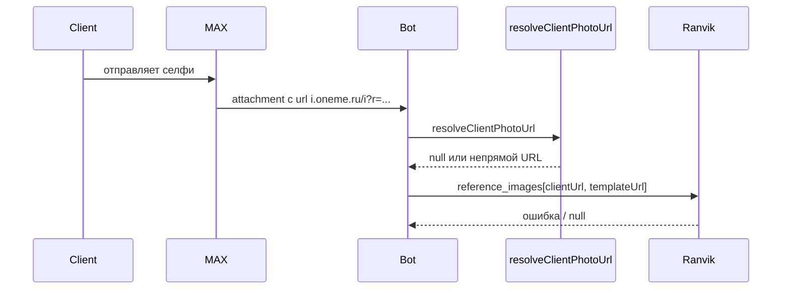

# Загрузка селфи из MAX через base64 в Ranvik API

## Текущее состояние и корень проблемы



- [`src/maxBot/scenes/haircutScene.js`](src/maxBot/scenes/haircutScene.js) в `handleSelfieMessage` вызывает [`resolveClientPhotoUrl`](src/utils/resolveClientPhotoUrl.js), который пытается получить **прямой HTTPS URL** через MAX Platform API или re-upload.
- Временные ссылки вида `https://i.oneme.ru/i?r=...` не проходят проверку `isDirectImageUrl` и часто не резолвятся — клиент получает «Не удалось получить ссылку на фото».
- [`src/services/aiHaircutService.js`](src/services/aiHaircutService.js) принимает только URL; base64 не поддерживается.
- [`src/utils/imageDownloader.js`](src/utils/imageDownloader.js) **отсутствует**.

Целевой поток:

```mermaid
sequenceDiagram
  participant Client
  participant MAX
  participant Bot
  participant Downloader as imageDownloader
  participant Ranvik

  Client->>MAX: селфи как вложение
  MAX->>Bot: payload.url (oneme.ru)
  Bot->>Downloader: downloadImageAsBase64(url)
  Downloader-->>Bot: data:image/...;base64,...
  Bot->>Ranvik: reference_images[base64, templateHttpsUrl]
  Ranvik-->>Bot: result URL
  Bot->>Client: результат через uploadImage
```

---

## 1. Создать [`src/utils/imageDownloader.js`](src/utils/imageDownloader.js)

Новый модуль с одной экспортируемой функцией:

```js
/**
 * @param {string} url — HTTPS URL изображения (в т.ч. временная ссылка MAX)
 * @returns {Promise<string|null>} data URI (data:image/{mime};base64,...) или null
 */
async function downloadImageAsBase64(url) { ... }
```

Реализация по ТЗ:

| Требование  | Детали                                                                                                                                                         |
| ----------- | -------------------------------------------------------------------------------------------------------------------------------------------------------------- |
| HTTP-клиент | нативный `fetch` (Node 18+, проект уже использует fetch)                                                                                                       |
| Таймаут     | `AbortController`, 10 000 ms                                                                                                                                   |
| MIME        | из `Content-Type` ответа; допустимы только `image/jpeg`, `image/png`, `image/webp`                                                                             |
| Размер      | после скачивания проверить `buffer.byteLength <= 10 * 1024 * 1024` (константа из [`security.js`](src/utils/security.js) — импорт `MAX_IMAGE_ATTACHMENT_BYTES`) |
| Возврат     | `data:${mime};base64,${buffer.toString('base64')}`                                                                                                             |
| Ошибки      | любой сбой (404, timeout, abort, неверный MIME, >10 МБ) → `null` + `console.warn/error` с причиной                                                             |
| Логирование | старт (`url` без query-параметров или усечённый), размер в байтах, длительность (`Date.now()`), успех/ошибка                                                   |

Дополнительно (не в ТЗ, но важно для oneme.ru):

- Проверить URL через существующий [`validateSafeUrl`](src/utils/security.js) перед fetch.
- `fetch` по умолчанию следует редиректам — этого достаточно для временных ссылок MAX.

---

## 2. Обновить [`src/services/aiHaircutService.js`](src/services/aiHaircutService.js)

### 2.1. Добавить `normalizeClientPhoto(clientPhoto)`

Логика нормализации первого reference image:

- `Buffer` → `data:image/jpeg;base64,{base64}`
- строка начинается с `data:image/` или `http://` / `https://` → передать как есть
- иначе считать «чистым» base64 → добавить префикс `data:image/jpeg;base64,`

Вернуть `null` для пустого/невалидного ввода.

### 2.2. Изменить `generateHaircut(clientPhoto, templatePhotoUrl, templateName?)`

- Первый параметр: `string | Buffer` (URL, data URI или base64).
- В начале функции: `const normalizedClientPhoto = normalizeClientPhoto(clientPhoto)`.
- Передавать `normalizedClientPhoto` в `buildRequestBody` → `reference_images[0]`.
- Шаблон стрижки (`templatePhotoUrl`) остаётся HTTPS URL из [`haircutTemplates.json`](haircutTemplates.json) — без изменений.

### 2.3. Безопасное логирование (критично)

Сейчас сервис логирует полный `requestBody` и `reference_images` — с base64 это мегабайты в консоль. При реализации:

- логировать длину/префикс client photo: `[base64, N chars]` или `[url, ...]`
- **не** логировать полную base64-строку и не делать `JSON.stringify` всего body

### 2.4. JSDoc

Обновить описание `@param clientPhoto` и `@returns` согласно новому формату.

---

## 3. Обновить [`src/maxBot/scenes/haircutScene.js`](src/maxBot/scenes/haircutScene.js)

### 3.1. Импорты

- Убрать `resolveClientPhotoUrl`.
- Добавить `downloadImageAsBase64` из `../../utils/imageDownloader`.

### 3.2. `handleSelfieMessage` — шаг `awaiting_selfie`

**Валидация вложения** (уже частично есть через `getMessageImageAttachment` + `validateImageAttachment`):

- Нет image attachment + есть текст → «Пожалуйста, пришлите фото (не текст)...» (уже есть, оставить).
- `validation.valid === false` → заменить текст на точный из ТЗ: _«Пожалуйста, отправьте фото в формате JPEG, PNG или WebP размером до 10 МБ.»_

**Извлечение URL:**

```js
const payload = attachment.payload || attachment;
const clientPhotoUrl = payload?.url || attachment?.url || null;
```

**Скачивание:**

```js
const startedAt = Date.now();
let clientPhotoBase64 = null;
try {
  clientPhotoBase64 = await downloadImageAsBase64(clientPhotoUrl);
  console.log('[haircutScene] download ok', { bytes: ..., ms: Date.now() - startedAt });
} catch (error) {
  console.error('[haircutScene] downloadImageAsBase64 error:', error);
}
```

- `null` / exception → _«Не удалось загрузить ваше фото. Попробуйте отправить другое фото или напишите /cancel для отмены.»_ + клавиатура `buildErrorKeyboard()`.

**Генерация:**

- Переименовать параметр `runGeneration(ctx, clientPhoto)` (вместо `clientPhotoUrl`).
- Вызов: `generateHaircut(clientPhotoBase64, template.photoUrl, template.name)`.
- **Не сохранять** base64 в `ctx.session` — только локальная переменная в стеке вызова (GC после завершения `runGeneration`).

**Ranvik ошибка** — сообщение уже есть в `runGeneration`; при необходимости уточнить текст, но менять не обязательно.

### 3.3. Удалить отладочный dump

Убрать `JSON.stringify(attachment, null, 2)` — достаточно логировать type, size, url host.

---

## 4. Что не трогаем

- [`src/utils/resolveClientPhotoUrl.js`](src/utils/resolveClientPhotoUrl.js) — оставить файл (может пригодиться), но **убрать использование** из haircut-сцены.
- [`validateImageAttachment`](src/utils/security.js), [`getMessageImageAttachment`](src/maxBot/admin/helpers.js) — переиспользовать без изменений.
- Бизнес-логика booking, шаблоны, клавиатуры — без изменений.
- Новые npm-зависимости — **не добавлять**.

---

## 5. Проверка после реализации

Ручной сценарий в MAX:

1. «Подобрать стрижку» → выбрать шаблон → отправить селфи как вложение (не ссылку).
2. В логах: `[imageDownloader] start`, размер файла, время скачивания, `[aiHaircutService] success`.
3. Клиент получает сгенерированное фото с кнопками результата.
4. Негативные кейсы:
   - текст вместо фото → просьба прислать фото;
   - файл >10 МБ / неверный MIME → сообщение о формате;
   - симуляция битой ссылки → сообщение о повторной отправке.

Синтаксическая проверка:

```bash
node -c src/utils/imageDownloader.js
node -c src/services/aiHaircutService.js
node -c src/maxBot/scenes/haircutScene.js
```

---

## Затрагиваемые файлы

| Файл                                                                     | Действие                                                 |
| ------------------------------------------------------------------------ | -------------------------------------------------------- |
| [`src/utils/imageDownloader.js`](src/utils/imageDownloader.js)           | **Создать**                                              |
| [`src/services/aiHaircutService.js`](src/services/aiHaircutService.js)   | **Обновить** — normalizeClientPhoto, JSDoc, safe logging |
| [`src/maxBot/scenes/haircutScene.js`](src/maxBot/scenes/haircutScene.js) | **Обновить** — download → base64 → generateHaircut       |
