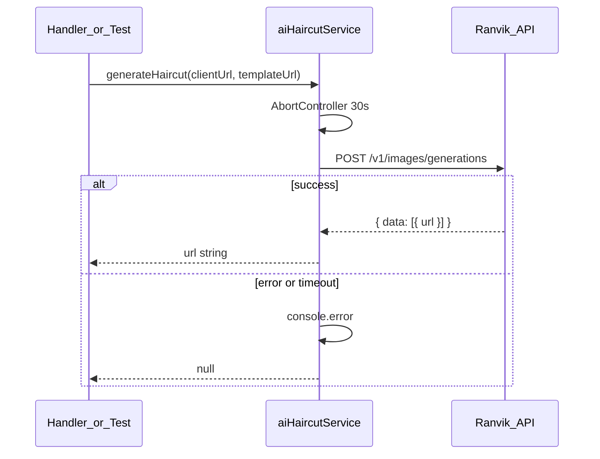

# План: сервис интеграции с Ranvik API (AI-подбор стрижки)

## Контекст

- В проекте нет существующей интеграции с Ranvik — новый файл не конфликтует с текущим кодом.
- Node.js 18+ и нативный `fetch` уже соответствуют требованиям ([package.json](package.json), [README.md](README.md)).
- Паттерн сервисов: CommonJS, `console.error` при сбоях, возврат `null` вместо throw — как в [src/services/googleCalendar.js](src/services/googleCalendar.js).

## Что создаём

Один файл: [src/services/aiHaircutService.js](src/services/aiHaircutService.js)



## Структура файла

### Константы (верх файла)

| Константа            | Значение                                                                     |
| -------------------- | ---------------------------------------------------------------------------- |
| `RANVIK_API_URL`     | `https://api.ranvik.ru/v1/images/generations`                                |
| `MODEL`              | `nano-banana` (комментарий: заменить на `nano-banana-pro` при необходимости) |
| `PROMPT`             | Текст из ТЗ дословно                                                         |
| `REQUEST_TIMEOUT_MS` | `30000`                                                                      |

### Функция `generateHaircut(clientPhotoUrl, templatePhotoUrl)`

**JSDoc:**

- `@param {string} clientPhotoUrl` — HTTPS URL селфи клиента
- `@param {string} templatePhotoUrl` — HTTPS URL шаблона стрижки
- `@returns {Promise<string|null>}` — URL сгенерированного изображения или `null`

**Тело запроса (JSON):**

```javascript
{
  model: "nano-banana",
  prompt: "Replace only the hairstyle...",
  reference_images: [clientPhotoUrl, templatePhotoUrl],
  n: 1,
  aspect_ratio: "1:1",
}
```

**Заголовки:**

- `Authorization: Bearer ${process.env.RANVIK_API_KEY}`
- `Content-Type: application/json`

**Реализация fetch + таймаут:**

```javascript
const controller = new AbortController();
const timeoutId = setTimeout(() => controller.abort(), REQUEST_TIMEOUT_MS);

try {
  const response = await fetch(RANVIK_API_URL, {
    method: "POST",
    headers: { ... },
    body: JSON.stringify(payload),
    signal: controller.signal,
  });
  // ...
} catch (error) {
  console.error("[aiHaircutService] generateHaircut error:", error);
  return null;
} finally {
  clearTimeout(timeoutId);
}
```

**Обработка ответа:**

1. Если `!response.ok` — залогировать статус и тело ошибки (если JSON/text доступен), вернуть `null`.
2. Распарсить JSON, вернуть `responseBody.data?.[0]?.url ?? null`.
3. Если URL отсутствует — `console.error` с кратким описанием, вернуть `null`.

**Дополнительная защита (минимальная):**

- Если `process.env.RANVIK_API_KEY` не задан — `console.error` и немедленный `return null` (без запроса к API).

### Экспорт и пример использования

```javascript
module.exports = {
  generateHaircut,
};
```

В комментарии в конце файла — пример:

```javascript
// const { generateHaircut } = require("./aiHaircutService");
//
// const resultUrl = await generateHaircut(
//   "https://example.com/client-selfie.jpg",
//   "https://example.com/haircut-template.jpg",
// );
//
// if (resultUrl) {
//   console.log("Generated:", resultUrl);
// } else {
//   console.log("Generation failed");
// }
```

## Что НЕ входит в scope (по ТЗ)

- Изменения handlers, сценариев бота, `index.js`
- Добавление `RANVIK_API_KEY` в [src/config/index.js](src/config/index.js) или README — потребуется при подключении к UX, но для работы сервиса достаточно переменной в `.env`
- Новые npm-зависимости
- Тесты

## Переменная окружения

Перед использованием в `.env`:

```
RANVIK_API_KEY=rk_live_...
```

Ключ получается в личном кабинете [api.ranvik.ru](https://api.ranvik.ru/).

## Проверка после реализации

1. Убедиться, что файл синтаксически корректен: `node -c src/services/aiHaircutService.js`
2. Ручной smoke-test (опционально, при наличии ключа):

```javascript
require("dotenv").config();
const { generateHaircut } = require("./src/services/aiHaircutService");
generateHaircut("https://...", "https://...").then(console.log);
```

Ожидание: URL строкой при успехе, `null` при ошибке/таймауте/отсутствии ключа.
