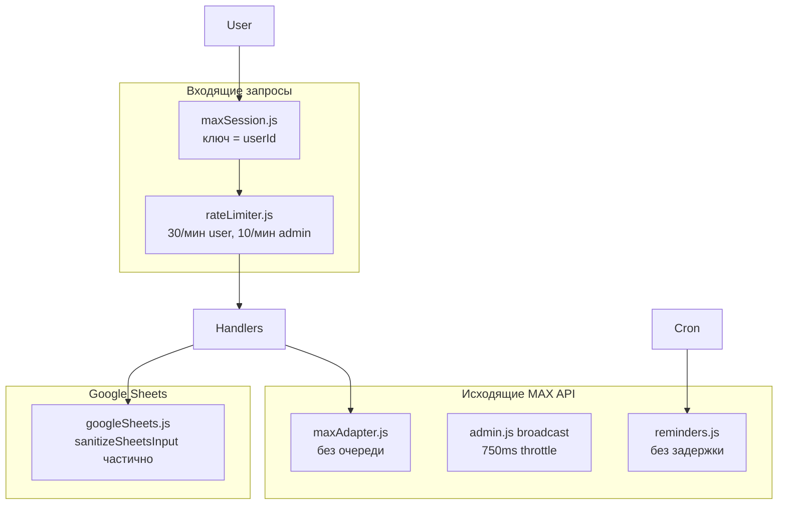
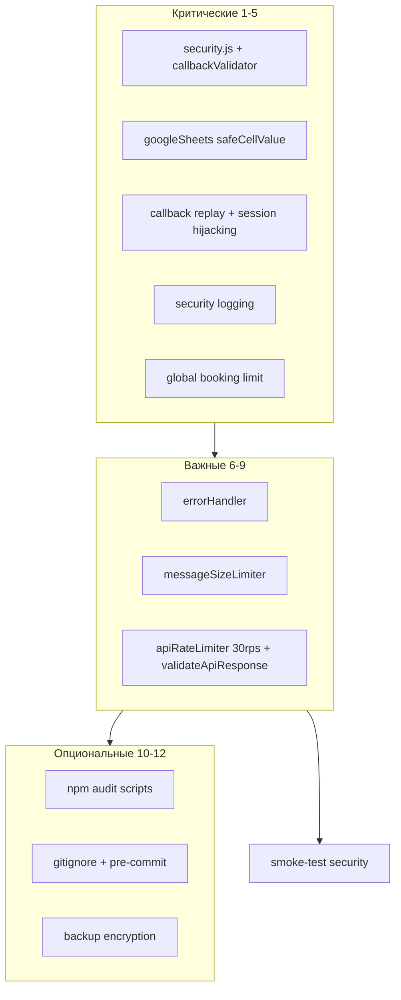

# План: безопасность MAX Bot (расширенный)

## Официальные лимиты MAX Bot API

Эти ограничения — источник истины при настройке rate limiter и валидации:

| Лимит                  | Значение                                       | Влияние на реализацию                                                       |
| ---------------------- | ---------------------------------------------- | --------------------------------------------------------------------------- |
| Частота запросов       | **до 30 rps** на `platform-api.max.ru`         | Token bucket в `apiRateLimiter.js`; при 429 — заголовок **`Retry-After`**   |
| Длина текста сообщения | **4000 символов**                              | `messageSizeLimiter` middleware; `sanitizeText(..., 4000)`                  |
| Inline-кнопки          | до **210** кнопок, **30** рядов, ~**7** в ряду | Валидация при сборке клавиатур в `maxKeyboard.js` / admin keyboards (guard) |
| Загрузка файлов        | до **4 ГБ** (`POST /uploads`)                  | Для портфолио/рассылок — жёсткий лимит **10 МБ** в приложении               |
| Webhook timeout        | ответ сервера до **30 сек**                    | Handlers не должны блокировать > 30s; тяжёлые операции — async              |
| Long polling           | timeout 0–90, limit до 1000                    | Только отладка; production — webhook                                        |
| Удаление сообщений     | только младше **24 часов**                     | Не полагаться на delete в старых сообщениях                                 |

---

## Текущее состояние



| Область              | Есть                                                                           | Не хватает                                             |
| -------------------- | ------------------------------------------------------------------------------ | ------------------------------------------------------ |
| Inbound rate limit   | [`src/middleware/rateLimiter.js`](src/middleware/rateLimiter.js) — 30/10 в мин | Scene limit 5/мин; callback replay; message size guard |
| Outbound MAX API     | Throttle только в рассылках                                                    | Token bucket **30 rps**, `Retry-After`, reminders      |
| Санитизация          | [`src/utils/security.js`](src/utils/security.js) — частично                    | Все handlers; attachment validation                    |
| Google Sheets        | `RAW` + `sanitizeSheetsInput` на 6 полях                                       | Все write-пути; read validation                        |
| Session              | [`src/middleware/maxSession.js`](src/middleware/maxSession.js) — ключ `userId` | Привязка `userId:chatId`                               |
| Security logging     | [`src/utils/logger.js`](src/utils/logger.js) — `logCriticalAction`             | `logSecurityEvent`, `maskSensitiveData`, event types   |
| Callback security    | Нет                                                                            | `validateCallbackTimestamp`                            |
| Global booking limit | Per-user 3 записи                                                              | Глобальный 10/мин                                      |

**Важно:** SQL в проекте нет. Эквивалентный риск — **formula injection** (`=`, `+`, `-`, `@`).

---

## Порядок middleware в [`index.js`](index.js)

Все новые middleware подключаются **строго в этом порядке** (до регистрации handlers):

```js
bot.use(maxSession()); // 1. сессии (userId:chatId)
bot.use(callbackValidator); // 2. replay protection для message_callback
bot.use(rateLimiter); // 3. inbound rate limits
bot.use(messageSizeLimiter); // 4. DoS через большие сообщения
// ... регистрация handlers
```

---

## 1. Rate limiting для MAX API

### 1.1 Inbound — дополнить [`rateLimiter.js`](src/middleware/rateLimiter.js)

- Тип `scene`: **5 запросов/мин** при `ctx.session.step` в `BOOKING_STEPS`.
- Приоритет: `admin` > `scene` > `general`.
- При превышении: ответ пользователю + `logSecurityEvent(userId, 'rate_limit_exceeded', …)`.

### 1.2 Outbound — [`src/utils/apiRateLimiter.js`](src/utils/apiRateLimiter.js)

- **Token bucket: 30 rps** (официальный лимит `platform-api.max.ru`).
- Burst: до 30 запросов в секунду, далее очередь.
- **429**: читать HTTP-заголовок **`Retry-After`** (секунды); fallback — `err.retry_after` / exponential backoff (2s → 4s → 8s), до 3 повторов.
- Публичный API: `schedule(fn)` / `withRateLimit(fn)`.
- Broadcast: убрать дублирующий `setTimeout(750ms)` — единая очередь (750ms ≈ 1.3 rps было консервативнее 30 rps; при массовых рассылках можно добавить опцию `minIntervalMs` для снижения нагрузки).

### 1.3 Интеграция outbound limiter

| Точка                                            | Изменение                                                               |
| ------------------------------------------------ | ----------------------------------------------------------------------- |
| [`maxAdapter.js`](src/adapters/maxAdapter.js)    | `sendMessageToUser`, `sendMessageToChat`, `uploadImage` — через limiter |
| [`admin.js`](src/services/admin.js)              | Broadcast через limiter                                                 |
| [`reminders.js`](src/services/reminders.js)      | Cron-отправки через limiter                                             |
| [`userHandlers.js`](src/maxBot/userHandlers.js)  | `uploadImage` через adapter/limiter                                     |
| [`safeMessaging.js`](src/utils/safeMessaging.js) | 429 под `MaxError` + `Retry-After`                                      |

### 1.4 Лимиты клавиатур (guard)

В [`src/utils/maxKeyboard.js`](src/utils/maxKeyboard.js) или при сборке admin-клавиатур — assert: ≤ 30 рядов, ≤ 7 кнопок в ряду, ≤ 210 кнопок суммарно. При превышении — лог + обрезка/ошибка в dev.

---

## 2. Санитизация всех пользовательских вводов

### 2.1 Расширить [`security.js`](src/utils/security.js)

| Функция                                 | Назначение                                                    |
| --------------------------------------- | ------------------------------------------------------------- |
| `validateServiceKey(key)`               | `/^[A-Za-z0-9_]{1,50}$/`                                      |
| `validateTimeStr(time)`                 | `HH:MM`, 00–23 / 00–59                                        |
| `validateDateStr(date)`                 | `YYYY-MM-DD` или `DD.MM.YYYY`                                 |
| `validateSafeUrl(url)`                  | `http://`, `https://`, `t.me/`; блок `javascript:`, `data:`   |
| `sanitizeDisplayName(name)`             | `validateName` + безопасное экранирование для отображения     |
| `parseCallbackPayload(payload, prefix)` | Извлечение и валидация суффикса                               |
| `validateImageAttachment(attachment)`   | Макс **10 МБ**; MIME: `image/jpeg`, `image/png`, `image/webp` |
| `validateCallbackTimestamp(ctx)`        | Callback не старше **10 мин** (`MAX_AGE_MS = 600_000`)        |

**`validateCallbackTimestamp`** — читать `ctx.update?.timestamp` (мс, как в Update MAX API). Если timestamp отсутствует — пропускать (обратная совместимость) или отклонять в strict-режиме для admin callbacks.

### 2.2 Handlers — закрыть пробелы

| Файл                                                                  | Исправление                                                                        |
| --------------------------------------------------------------------- | ---------------------------------------------------------------------------------- |
| [`bookingScene.js`](src/maxBot/scenes/bookingScene.js)                | phone, time, service key; **validateCallbackTimestamp** в начале callback handlers |
| [`userHandlers.js`](src/maxBot/userHandlers.js)                       | `sanitizeDisplayName`; `validateSafeUrl`                                           |
| [`admin/domains/services.js`](src/maxBot/admin/domains/services.js)   | `sanitizeText`; `validateServiceKey`                                               |
| [`admin/domains/settings.js`](src/maxBot/admin/domains/settings.js)   | contacts, address, URLs; **`validateImageAttachment`** для портфолио               |
| [`admin/domains/broadcast.js`](src/maxBot/admin/domains/broadcast.js) | caption `sanitizeText(4000)`; **`validateImageAttachment`**                        |
| [`admin/domains/schedule.js`](src/maxBot/admin/domains/schedule.js)   | `validateDateStr` / `validateTimeStr`                                              |

### 2.3 Defense in depth в [`booking.js`](src/services/booking.js)

Guard в `bookAppointment`: `validateName`, `validatePhone`, `sanitizeText` для comment.

---

## 3. Защита Google Sheets (formula injection)

### 3.1 `safeCellValue` в [`googleSheets.js`](src/services/googleSheets.js)

Обёртка над `sanitizeSheetsInput` для **всех** строковых write (~25 точек). При обнаружении formula-паттерна — `logSecurityEvent(..., 'formula_injection_attempt', …)`.

### 3.2 Валидация read-параметров

`validateTelegramId`, `validateAppointmentId`, `validateDateStr`, cancel code `/^[A-Z0-9]{6}$/`.

### 3.3 Усилить `sanitizeSheetsInput`

Префикс `'` для `=+\-@\t\r`; удаление `\x00`; опционально `\|` (CSV-injection).

---

## 4. Критические дополнения (обязательно до production)

### 4.1 Callback replay protection

**Файл:** [`src/middleware/callbackValidator.js`](src/middleware/callbackValidator.js) (или `security.js` + thin middleware)

```js
const MAX_AGE_MS = 10 * 60 * 1000; // 10 минут

/**
 * Проверяет актуальность callback по timestamp из Update.
 * @param {object} ctx — контекст MAX Bot
 * @returns {{ valid: boolean, reason?: string }}
 */
function validateCallbackTimestamp(ctx) {
  /* ... */
}
```

- Middleware: только для `message_callback`; при `valid === false` → `answerCallback` + `logSecurityEvent(..., 'invalid_callback')` + **не вызывать `next()`**.
- Дублирующий вызов в начале callback-обработчиков [`registerAdminHandlers.js`](src/maxBot/admin/registerAdminHandlers.js) и [`bookingScene.js`](src/maxBot/scenes/bookingScene.js) (defense in depth для `bot.action`).

### 4.2 Session hijacking protection

**Файл:** [`src/middleware/maxSession.js`](src/middleware/maxSession.js)

```js
function getSessionKey(ctx) {
  const userId = ctx.user?.user_id;
  if (userId == null) return null;
  const chatId = resolveChatId(ctx); // из maxChat.js
  return chatId != null ? `${userId}:${chatId}` : String(userId);
}
```

- Сохранить миграцию из `findLegacyUserSession` (старые ключи `userId` и `userId:chatId`).
- При несовпадении chat_id в сессии и контексте — `logSecurityEvent(..., 'session_hijack_attempt', severity: 'CRITICAL')`.

### 4.3 Attachment validation

`validateImageAttachment(attachment)` в [`security.js`](src/utils/security.js):

- Размер ≤ **10 МБ** (несмотря на лимит MAX 4 ГБ).
- MIME: `image/jpeg`, `image/png`, `image/webp`.
- Применить в [`settings.js`](src/maxBot/admin/domains/settings.js) (портфолио) и [`broadcast.js`](src/maxBot/admin/domains/broadcast.js) (рассылка с фото).

### 4.4 Security logging

Расширить [`src/utils/logger.js`](src/utils/logger.js):

```js
/**
 * @param {string|number} userId
 * @param {string} eventType — rate_limit_exceeded | formula_injection_attempt | invalid_callback | session_hijack_attempt | global_booking_limit_exceeded
 * @param {object} details — маскируется через maskSensitiveData
 * @param {'INFO'|'WARNING'|'CRITICAL'} severity
 */
async function logSecurityEvent(userId, eventType, details, severity) {
  /* JSON → logs/security.log */
}

/**
 * Маскирует PII: телефоны +712367, имена И** П***
 */
function maskSensitiveData(data) {
  /* ... */
}
```

**Интеграция `logSecurityEvent`:**

| Точка                               | eventType                       |
| ----------------------------------- | ------------------------------- |
| `rateLimiter.js`                    | `rate_limit_exceeded`           |
| `googleSheets.js` / `safeCellValue` | `formula_injection_attempt`     |
| `callbackValidator.js`              | `invalid_callback`              |
| `maxSession.js`                     | `session_hijack_attempt`        |
| `booking.js` global limit           | `global_booking_limit_exceeded` |

При `severity === 'CRITICAL'` → `bot.api.sendMessageToUser(config.managerChatId, '🚨 ' + eventType)` (через apiRateLimiter).

### 4.5 Global booking rate limit

**Файл:** [`src/services/booking.js`](src/services/booking.js)

```js
const GLOBAL_BOOKING_LIMIT = 10; // записей в минуту (все пользователи)
const globalBookingTimestamps = []; // Map/array + sliding window 60s

// В начале bookAppointment(), ДО валидации клиента:
if (!checkGlobalBookingLimit()) {
  logSecurityEvent('system', 'global_booking_limit_exceeded', …, 'CRITICAL');
  return { ok: false, reason: 'global_limit' };
}
```

Защита от ботнет-атаки: массовые записи с разных `user_id`, блокирующие слоты.

---

## 5. Важные дополнения (желательно до production)

### 5.1 Error sanitization — [`src/utils/errorHandler.js`](src/utils/errorHandler.js)

```js
/**
 * Возвращает безопасное сообщение для пользователя.
 * Stack trace и пути — только в NODE_ENV=development.
 */
function sanitizeErrorMessage(error) {
  if (process.env.NODE_ENV === "development") {
    return error?.message || "Произошла ошибка";
  }
  return "Произошла ошибка";
}
```

Применить во всех `catch` перед `ctx.reply` / `adapter.reply` (handlers, adapter, services). Внутренние детали — в `logError` / `logSecurityEvent` с `maskSensitiveData`.

### 5.2 Message size limiter — [`src/middleware/messageSizeLimiter.js`](src/middleware/messageSizeLimiter.js)

- Проверка `ctx.message?.body?.text?.length > 4000`.
- Ответ: «Сообщение слишком длинное (максимум 4000 символов)».
- Подключить в `index.js` после rate limiter.

### 5.3 API response validation — [`maxAdapter.js`](src/adapters/maxAdapter.js)

```js
/**
 * @param {object} response — ответ MAX API
 * @param {string[]} expectedFields — ожидаемые поля
 * @returns {boolean}
 */
function validateApiResponse(response, expectedFields) {
  /* ... */
}
```

Вызывать после `sendMessageToUser`, `sendMessageToChat`, `uploadImage`. При malformed response — лог + `null` (не TypeError в downstream).

---

## 6. Опциональные улучшения (можно после production)

### 6.1 Dependency security audit — [`package.json`](package.json)

```json
{
  "scripts": {
    "security:audit": "npm audit --production",
    "security:fix": "npm audit fix --production",
    "security:check": "npm run security:audit && npx snyk test"
  }
}
```

Рекомендация: запускать `security:check` еженедельно.

### 6.2 Environment security

Расширить [`.gitignore`](.gitignore):

```
.env.local
.env.production
logs/
backups/
```

Уже есть: `.env`, `credentials.json`, `sessions.json`, `banned.json`.

**Pre-commit hook** (`.git/hooks/pre-commit` — предложить, не коммитить в репо):

- Блокировать staged-файлы: `.env*`, `credentials.json`, `sessions.json`, `banned.json`, `logs/`, `backups/`.
- Exit code 1 с понятным сообщением.

### 6.3 Backup encryption — [`src/utils/backup.js`](src/utils/backup.js) (новый)

```js
/**
 * Шифрует бэкап sessions/banned AES-256-CBC.
 * Ключ из пароля через crypto.scryptSync.
 */
function encryptBackup(data, password) {
  /* aes-256-cbc + scryptSync */
}
function decryptBackup(encrypted, password) {
  /* ... */
}
```

Применять при экспорте `sessions.json` / `banned.json` с PII.

---

## 7. Порядок реализации по приоритету



**Фаза 1 (критические):**

1. `security.js` (включая `validateCallbackTimestamp`, `validateImageAttachment`)
2. `callbackValidator.js` + session `userId:chatId`
3. `logger.js` (`logSecurityEvent`, `maskSensitiveData`)
4. `googleSheets.js` (`safeCellValue` + read validation)
5. `booking.js` (client guard + global 10/min limit)
6. Handlers sanitization + attachment validation

**Фаза 2 (важные):** 7. `errorHandler.js` 8. `messageSizeLimiter.js` 9. `apiRateLimiter.js` (30 rps, Retry-After) + `validateApiResponse` 10. Inbound scene limit + middleware order в `index.js`

**Фаза 3 (опциональные):** 11. `package.json` security scripts 12. `.gitignore` + pre-commit hook (документация) 13. `backup.js` encryption

---

## 8. Smoke-test (MASTER.md + security)

| Тест                                    | Ожидание                                                     |
| --------------------------------------- | ------------------------------------------------------------ |
| Booking flow                            | Работает как раньше                                          |
| Rate limit user/admin/scene             | Сообщение «Слишком много запросов»                           |
| Callback с timestamp > 10 мин           | Отклонён, `invalid_callback` в логе                          |
| Formula injection в имени (`=CMD`)      | Префикс `'` в Sheets; `formula_injection_attempt` в логе     |
| > 10 записей за минуту (разные user_id) | `{ ok: false, reason: 'global_limit' }`                      |
| Сообщение > 4000 символов               | Отклонено middleware                                         |
| `logs/security.log`                     | Телефоны маскированы (`+712367`), имена (`И** П***`)         |
| Broadcast / reminders                   | Без 429 при нормальной нагрузке; retry при искусственном 429 |
| Admin CRITICAL event                    | Уведомление на `managerChatId`                               |

---

## 9. Требования к коду

- Все новые функции — **JSDoc** (назначение, параметры, возвращаемое значение).
- **Обратная совместимость**: миграция сессий, fallback timestamp, существующие callback payloads.
- **Не менять** бизнес-алгоритмы booking (слоты, лимит 3 записей на user) — только guards и limits.
- **Не менять** структуру admin domains.

---

## 10. Риски и ограничения

- `sanitizeText` HTML-escapes — для plain text MAX; для имён — `sanitizeDisplayName` с минимальным экранированием.
- Session key `userId:chatId`: в DM `message_created` chat_id может отсутствовать → fallback `userId` (как сейчас, через `persistChatId` в `bot_started`).
- `snyk test` в `security:check` требует аккаунт Snyk — документировать как опциональный шаг.
- Pre-commit hook в `.git/hooks/` — локальный, не версионируется; можно добавить setup-скрипт в `scripts/`.
