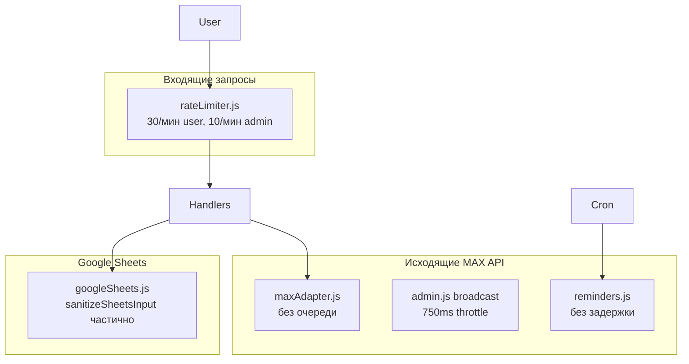
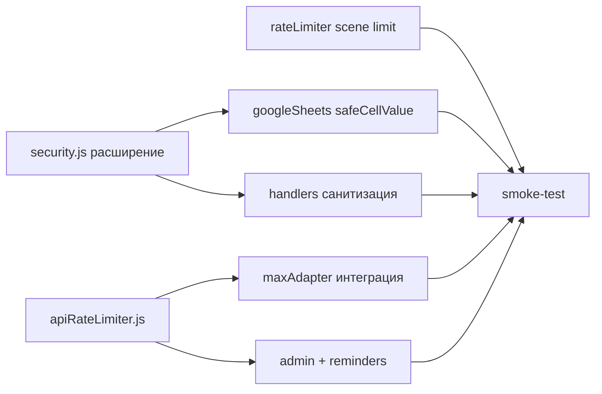

# План: безопасность MAX Bot (rate limiting, санитизация, Google Sheets)

## Текущее состояние



| Область            | Есть                                                                                    | Не хватает                                                                                     |
| ------------------ | --------------------------------------------------------------------------------------- | ---------------------------------------------------------------------------------------------- |
| Inbound rate limit | [`src/middleware/rateLimiter.js`](src/middleware/rateLimiter.js) — 30/10 в мин          | Лимит сцены записи **5/мин** ([`MASTER.md`](MASTER.md) L1693) не реализован                    |
| Outbound MAX API   | Throttle только в рассылках ([`src/services/admin.js`](src/services/admin.js) L6)       | Централизованная очередь, retry на 429, throttle для reminders                                 |
| Санитизация        | [`src/utils/security.js`](src/utils/security.js) — booking, broadcast text, часть admin | Пробелы в contact share, admin services/contacts, captions, `ctx.user.name`, callback payloads |
| Google Sheets      | `valueInputOption: "RAW"` + `sanitizeSheetsInput` на 6 полях                            | Не все write-пути; нет валидации query-параметров на read                                      |

**Важно:** SQL в проекте нет — Google Sheets API использует фиксированные A1-диапазоны. Эквивалентный риск — **formula injection** (`=`, `+`, `-`, `@`). План закрывает его системно.

---

## 1. Rate limiting для MAX API

### 1.1 Inbound — дополнить существующий middleware

Файл: [`src/middleware/rateLimiter.js`](src/middleware/rateLimiter.js)

- Добавить тип лимита `scene` (**5 запросов/мин**), как в Telegram-версии ([`MASTER.md`](MASTER.md)).
- Определять сцену: `ctx.session?.step` входит в `BOOKING_STEPS` из [`src/maxBot/scenes/bookingScene.js`](src/maxBot/scenes/bookingScene.js) (экспортировать константу или вынести в `src/maxBot/constants.js`).
- Приоритет лимитов: `admin` > `scene` > `general` (админ в сцене записи не должен получать scene-лимит).
- Сообщение при превышении — то же, что сейчас.

### 1.2 Outbound — новый модуль очереди API

Новый файл: **`src/utils/apiRateLimiter.js`**

- Очередь с минимальным интервалом между вызовами (по умолчанию **750 ms** — как в broadcast).
- Публичный API: `schedule(fn)` / `withRateLimit(fn)` — оборачивает async-вызов MAX API.
- Обработка **429**: до 3 повторов с задержкой из `err.retry_after` / `err.response?.parameters?.retry_after` или экспоненциальный backoff (2s → 4s → 8s).
- Распознавание `MaxError` (как в [`index.js`](index.js) L27–31).

### 1.3 Интеграция outbound limiter

| Точка                                                      | Изменение                                                                                    |
| ---------------------------------------------------------- | -------------------------------------------------------------------------------------------- |
| [`src/adapters/maxAdapter.js`](src/adapters/maxAdapter.js) | Все `sendMessageToUser`, `sendMessageToChat`, `uploadImage` — через `apiRateLimiter`         |
| [`src/services/admin.js`](src/services/admin.js)           | Убрать дублирующий `setTimeout` в broadcast-loop; использовать общий limiter                 |
| [`src/services/reminders.js`](src/services/reminders.js)   | `sendMessageToUser` через limiter (сейчас без задержки — риск 429 при массовых напоминаниях) |
| [`src/maxBot/userHandlers.js`](src/maxBot/userHandlers.js) | Прямой `ctx.api.uploadImage` — через adapter или limiter                                     |

[`src/utils/safeMessaging.js`](src/utils/safeMessaging.js): обновить 429-обработку под формат `MaxError` (`err.status === 429`), сохранить обратную совместимость с Telegram-форматом.

---

## 2. Санитизация всех пользовательских вводов

### 2.1 Расширить [`src/utils/security.js`](src/utils/security.js)

Добавить функции (без дублирования логики):

| Функция                                 | Назначение                                                                                                  |
| --------------------------------------- | ----------------------------------------------------------------------------------------------------------- |
| `validateServiceKey(key)`               | `/^[A-Za-z0-9_]{1,50}$/` (переиспользовать regex из [`src/services/services.js`](src/services/services.js)) |
| `validateTimeStr(time)`                 | `/^\d{2}:\d{2}$/` + проверка 00–23 / 00–59                                                                  |
| `validateDateStr(date)`                 | `YYYY-MM-DD` или `DD.MM.YYYY` через dayjs                                                                   |
| `validateSafeUrl(url)`                  | Только `http://`, `https://`, `t.me/`; блок `javascript:`, `data:`                                          |
| `sanitizeDisplayName(name)`             | `validateName` + `sanitizeText` для отражения в сообщениях                                                  |
| `parseCallbackPayload(payload, prefix)` | Извлечение и валидация суффикса callback                                                                    |

### 2.2 Закрыть пробелы в handlers

| Файл                                                                  | Что исправить                                                                                                         |
| --------------------------------------------------------------------- | --------------------------------------------------------------------------------------------------------------------- |
| [`bookingScene.js`](src/maxBot/scenes/bookingScene.js)                | `extractPhoneFromContact` → `validatePhone`; `time:` callback → `validateTimeStr`; `book_svc:` → `validateServiceKey` |
| [`userHandlers.js`](src/maxBot/userHandlers.js)                       | `ctx.user.name` → `sanitizeDisplayName`; portfolio URL → `validateSafeUrl`                                            |
| [`admin/domains/services.js`](src/maxBot/admin/domains/services.js)   | Имя услуги → `sanitizeText(…, 100)`; key из callback → `validateServiceKey`                                           |
| [`admin/domains/settings.js`](src/maxBot/admin/domains/settings.js)   | Контакты/адрес → `sanitizeText` + `validatePhone` для телефона; ссылки → `validateSafeUrl`                            |
| [`admin/domains/broadcast.js`](src/maxBot/admin/domains/broadcast.js) | Caption фото → `sanitizeText(…, 4000)`                                                                                |
| [`admin/domains/schedule.js`](src/maxBot/admin/domains/schedule.js)   | Даты/время — через `validateDateStr` / `validateTimeStr`                                                              |
| [`admin/domains/bookings.js`](src/maxBot/admin/domains/bookings.js)   | Уже есть cancel code — без изменений                                                                                  |

### 2.3 Защита на уровне сервиса (defense in depth)

Тонкая обёртка в [`src/services/booking.js`](src/services/booking.js) в `bookAppointment`:

```js
// Перед записью в Sheets — повторная валидация client.name/phone/comment
if (!validateName(client.name) || !validatePhone(client.phone)) {
  return { ok: false, reason: "invalid_client" };
}
```

Не менять алгоритм бронирования — только guard в начале функции.

---

## 3. Защита Google Sheets (formula / query injection)

### 3.1 Центральный слой записи

В [`src/services/googleSheets.js`](src/services/googleSheets.js):

```js
function safeCellValue(value, maxLength = 500) {
  if (value == null) return "";
  if (typeof value === "number" || typeof value === "boolean") return value;
  return sanitizeSheetsInput(String(value), maxLength);
}
```

Применить `safeCellValue` ко **всем** строковым значениям в `values.append` / `values.update` (~25 точек записи), включая:

- `set28DayReminderMessage`, `setTipsLink`, `setBarberPhone`, `setBarberAddress`
- `setLocationLink`, `setLocationLink2gis`, `setPortfolioFileIds` (каждый элемент массива)
- `setWorkHoursForDate`, `setWeekdayTemplate`
- Поля appointment: `service`, `status` (если строка)

`valueInputOption: "RAW"` оставить — это первая линия защиты.

### 3.2 Валидация параметров чтения/поиска

В начале публичных методов `googleSheets.js`:

| Параметр           | Валидатор               |
| ------------------ | ----------------------- |
| `telegramId`       | `validateTelegramId`    |
| `id` (appointment) | `validateAppointmentId` |
| `dateStr`          | `validateDateStr`       |
| `cancelCode`       | regex `/^[A-Z0-9]{6}$/` |

При невалидном значении — `throw new Error(...)` или `return null` (как принято в каждом методе), **не** передавать в сравнения/filter.

Диапазоны A1: sheet name только из `SHEET_NAMES`, row index только `Number` из внутреннего scan — без изменений (уже безопасно).

### 3.3 Усилить `sanitizeSheetsInput`

В [`security.js`](src/utils/security.js):

- Префикс `'` для строк, начинающихся с `=`, `+`, `-`, `@`, **`\t`**, **`\r`**
- Удаление null-байтов `\x00`
- Опционально: блок `\|` в начале (CSV-injection в экспорте)

---

## 4. Порядок реализации



1. `security.js` + `safeCellValue` в Sheets (фундамент)
2. Handlers + `bookAppointment` guard
3. `apiRateLimiter.js` + интеграция в adapter/services
4. Scene limit в inbound middleware
5. Smoke-test по чеклисту из [`MASTER.md`](MASTER.md) (rate limit, booking flow, broadcast, reminders)

---

## 5. Что не меняем

- Бизнес-логику в [`src/services/booking.js`](src/services/booking.js) (алгоритмы слотов, лимит 3 записей) — только guard
- Структуру admin domains (после недавнего рефакторинга)
- Лимиты 250 получателей и 750ms throttle в broadcast — сохраняем, но через общий limiter

## 6. Риски и ограничения

- `sanitizeText` экранирует HTML — для MAX (plain text) это безопасно, но пользователь увидит `&amp;` если введёт `&`. Для отображаемых имён использовать `sanitizeDisplayName` с осознанным выбором: экранировать только опасные символы `<>&` или полный набор.
- Точные лимиты MAX API в документации проекта не зафиксированы — 750ms как в Telegram-версии; при 429 backoff подстроится автоматически.
